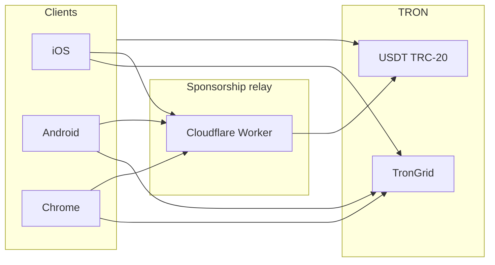

# Mesh Wallet

**Send USDT on TRON without holding TRX.**

Mesh is a self-custody wallet for TRC-20 USDT — native apps for iOS and Android, plus a Chrome extension. One recovery phrase, multiple accounts, signing on-device.

<p align="center">
  
</p>

<p align="center">
  <a href="https://apps.apple.com/us/app/mesh-usdt-wallet/id6773052229">
    
  </a>
  &nbsp;&nbsp;
  <a href="https://chromewebstore.google.com/detail/mesh-usdt-wallet/dahjpanhlinmadhfkamhmlcegppdcpcf">
    
  </a>
</p>

<p align="center">
  <a href="https://meshwallet.app">meshwallet.app</a>
  &nbsp;·&nbsp;
  <a href="https://meshwallet.app/support">Support</a>
</p>

---

## Overview

| | |
|---|---|
| **Network** | TRON (TRC-20) |
| **Asset** | USDT |
| **Custody** | Non-custodial — keys on device |

| Platform | Version | Requirements |
|----------|---------|--------------|
| iOS | 1.1.15 | iOS 17+ |
| Android | 1.1.7 | Android 8+ |
| Chrome | 1.0.3 | Manifest V3 |

Source of truth: [`versions.json`](versions.json) and per-platform `VERSION` files.

Mesh handles TRX energy and bandwidth through a sponsorship relay so everyday USDT transfers do not require a separate gas balance. Fees are itemized before you sign.

---

## Features

- **Gasless USDT sends** — no TRX balance required for typical transfers
- **Multi-account HD wallet** — separate receive/spend addresses under one seed
- **Privacy routing** — optional multi-hop sends from dedicated accounts
- **Background send recovery** — in-flight transfers resume after app restart
- **Passcode & biometrics** — app lock with secure enclave / keystore where available
- **Eight languages** — EN, ES, TR, VI, ID, AR, RU, ZH-Hans

---

## Architecture



Clients sign transactions locally. The relay delegates network resources (energy, activation) and coordinates queued sends — it never holds user keys.

See [docs/ARCHITECTURE.md](docs/ARCHITECTURE.md) for module layout and send flow.

---

## Repository structure

```
Mesh-Wallet/
├── mobile/
│   ├── ios/                 SwiftUI · Trust Wallet Core
│   └── android/             Kotlin · Jetpack Compose · Trust Wallet Core
├── extension/
│   └── chrome/              React · Vite · MV3
├── worker/
│   ├── mesh-sponsorship-worker/   Sponsorship relay (Cloudflare Workers)
│   └── mesh-contracts/            Tron send-router contract
├── docs/
│   └── ARCHITECTURE.md
├── public/                  Brand assets
├── LICENSE
└── SECURITY.md
```

---

## Development

### Prerequisites

| Tool | Version |
|------|---------|
| Xcode | 16+ (iOS) |
| Android Studio | Ladybug+ / JDK 17 |
| Node.js | 20+ |
| Wrangler | optional, worker local dev |

### Clone

```sh
git clone https://github.com/meshwallet/Mesh-Wallet.git
cd Mesh-Wallet
```

### iOS

```sh
open mobile/ios/Mesh.xcodeproj
```

Run the **Mesh** scheme. Configure TronGrid keys in `mobile/ios/Mesh/Info.plist` (see `Info.plist.example`).

### Android

```sh
cd mobile/android
cp local.properties.example local.properties
./gradlew assembleDebug
```

Trust Wallet Core requires a GitHub Packages token — see `mobile/android/README.md`.

### Chrome extension

```sh
cd extension/chrome
cp .env.example .env
npm ci
npm run dev
```

Load `extension/chrome/dist` as an unpacked extension. Configure keys in `.env`.

### Worker (local)

```sh
cd worker/mesh-sponsorship-worker
cp .dev.vars.example .dev.vars
npm ci
npm run dev
```

Source for the sponsorship relay and on-chain router. See `worker/README.md`.

---

## Security

Report vulnerabilities to **support@meshwallet.app** — do not open public issues for exploitable findings.

Full policy: [SECURITY.md](SECURITY.md)

---

## License

[MIT](LICENSE)
